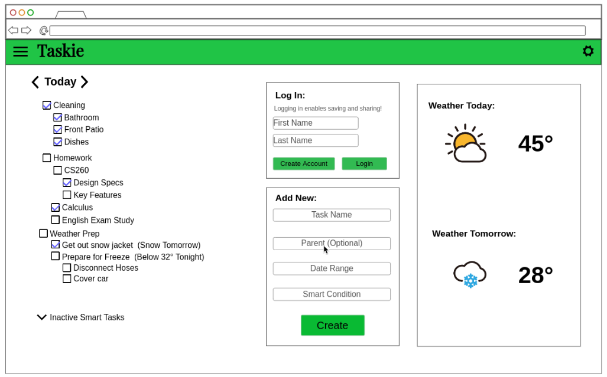
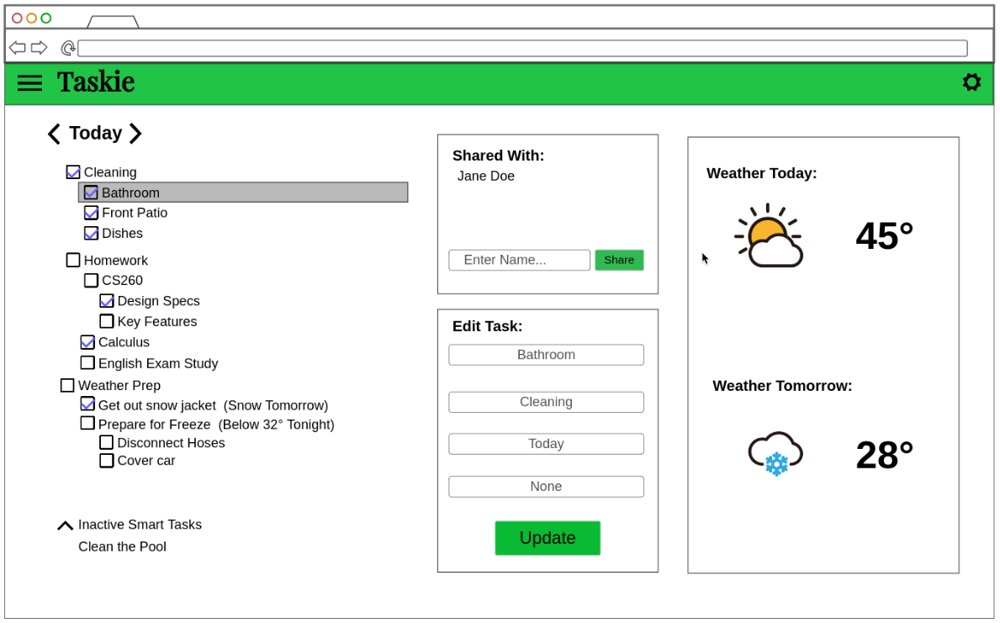

# Taskie - Smart tasks for your day

Taskie is a powerful task tracking application that allows you to create and track various tasks. Complete with categories, tasks, and subtasks, its easy to keep track of everything that you need to complete in a day. Invite a friend or spouse to join your task list. As you browse your tasks, get a quick view of the weather.

## 🚀 Specification Deliverable

For this deliverable I did the following. I checked the box `[x]` and added a description for things I completed.

- [x] Proper use of Markdown
- [x] A concise and compelling elevator pitch
- [x] Description of key features
- [x] Description of how you will use each technology
- [x] One or more rough sketches of your application. Images must be embedded in this file using Markdown image references.

### Elevator pitch

Taskie is a powerful task tracking application that allows you to create and track various tasks. Complete with categories, tasks, and subtasks, its easy to keep track of everything that you need to complete in a day. Invite a friend or spouse to join your task list. As you browse your tasks, get a quick view of the weather.

### Design

### Key features

- Login to save your list
- Add, remove, or edit tasks
- Nested tasks
- Share your task list with others
- Convenient weather display for task planning

### Technologies

I am going to use the required technologies in the following ways.

- **HTML** - Component structure will be defined using proper HTML with multiple dynamic components that will be show/hidden through React to create the effect of a dynamic, single-page app
- **CSS** - Stylization will be used for the on-screen organizations of the various components that will adapt to the screen size. It will have a unique theme throughout the application.
- **React** - Conditional rendering of various React-defined components in the style of a single-page dynamic application
- **Service** - A backend service with endpoints for:
  - login
  - Reading/writing user's task list
  - Accessing public weather API
- **DB/Login** - Store users and their task lists in a database. Authenticate users, save a user's task list if signed in to be accessible anywhere
- **WebSocket** - When a shared list is modified, the modification is broadcasted to all users currently on the shared list

## 🚀 AWS deliverable

For this deliverable I did the following. I checked the box `[x]` and added a description for things I completed.

- [x] **Server deployed and accessible with custom domain name** - [taskie.click](https://taskie.click).

## 🚀 HTML deliverable

For this deliverable I did the following. I checked the box `[x]` and added a description for things I completed.

- [x] **HTML pages** - I have my default login page along with the task list page and an Add Task page, 3 in total.
- [x] **Proper HTML element usage** - I have used proper HTML structure including BODY, NAV, MAIN, HEADER, and FOOTER on every one of my pages, including a logical structure for the content of the app.
- [x] **Links** - There are working links in both the header of the page and at places such as "Add Task" button on the task list and the "Create Task" button at the end of the creating task form links you back to the list.
- [x] **Text** - There are various textual descriptions and labels throughout the application to help describe how to properly use the app.
- [x] **3rd party API placeholder** - There is a placeholder for the external weather API that I will be querying.
- [x] **Images** - There are various images, such as a brand logo, chevron icons, and weather indicators on the site.
- [x] **Login placeholder** - The default page is a login/signup form that accepts an email and password. Additionally, the task list page includes your current username in the "Collaborators" section
- [x] **DB data placeholder** - The task list represents data that will be stored in a DB for each user
- [x] **WebSocket placeholder** - The collaborators section indicates who is currently active (all users who are currently on the websocket) and through the websocket the task list will automatically upate with changes made by other users.

## 🚀 CSS deliverable

For this deliverable I did the following. I checked the box `[x]` and added a description for things I completed.

- [x] **Header, footer, and main content body** - The majority of these elements were styled globally using main.scss, including many repeat elements of the body to havea consistent styling across the whole site.
- [x] **Navigation elements** - I did my own, simple, styled flex row nav bar
- [x] **Responsive to window resizing** - Using display flex and conditions upon when it should be row vs a column (especially on the lsit page) I was able to dynamically change the page to fit smaller screens
- [x] **Application elements** - Many elements were styled in a consistent manner across the site, giving a unified theme.
- [x] **Application text content** - Styled many text alignments, sizes, and colors in order to have a pleasant looking site
- [x] **Application images** - These tend to have inline styling to change the size of the images to fit appropriately. Once I add react, I will probably turn each of the images into a component that will be an inline SVG that can be stylized using CSS.

## 🚀 React part 1: Routing deliverable

For this deliverable I did the following. I checked the box `[x]` and added a description for things I completed.

- [x] **Bundled using Vite** - I just let npm run dev do its thing
- [x] **Components** - I built the login, add-task, and task-list component from the old html pages. They currently look and behave exactly the same as they did before react.
- [x] **Router** - Routing between login, task list, and add tasks through both the header tabs and through various on-page buttons (such as "Add Task" button on the task list)

## 🚀 React part 2: Reactivity

For this deliverable I did the following. I checked the box `[x]` and added a description for things I completed.

- [x] **All functionality implemented or mocked out** - I have created various React components, such as task-list, task-item, weather, collaborators, etc. These implement or mock every functionality the app has. I reactively generate HTML elements and React components to conditionally change text, available buttons, and the number of list elements.
- [x] **Hooks** - I have used useState and useEffect throughout my code, particularly for temporary local states. One difference in my project from many others is that I added in a state management store using Redux Toolkit. This results in me actually using less useState and useEffect, but the selectors and reducers used through Redux are functionally very similar to useState and useEffect and provide hooks to dynamically manage my application.

## 🚀 Service deliverable

For this deliverable I did the following. I checked the box `[x]` and added a description for things I completed.

- [ ] **Node.js/Express HTTP service** - I did not complete this part of the deliverable.
- [ ] **Static middleware for frontend** - I did not complete this part of the deliverable.
- [ ] **Calls to third party endpoints** - I did not complete this part of the deliverable.
- [ ] **Backend service endpoints** - I did not complete this part of the deliverable.
- [ ] **Frontend calls service endpoints** - I did not complete this part of the deliverable.

## 🚀 DB/Login deliverable

For this deliverable I did the following. I checked the box `[x]` and added a description for things I completed.

- [ ] **User registration** - I did not complete this part of the deliverable.
- [ ] **User login and logout** - I did not complete this part of the deliverable.
- [ ] **Stores data in MongoDB** - I did not complete this part of the deliverable.
- [ ] **Stores credentials in MongoDB** - I did not complete this part of the deliverable.
- [ ] **Restricts functionality based on authentication** - I did not complete this part of the deliverable.

## 🚀 WebSocket deliverable

For this deliverable I did the following. I checked the box `[x]` and added a description for things I completed.

- [ ] **Backend listens for WebSocket connection** - I did not complete this part of the deliverable.
- [ ] **Frontend makes WebSocket connection** - I did not complete this part of the deliverable.
- [ ] **Data sent over WebSocket connection** - I did not complete this part of the deliverable.
- [ ] **WebSocket data displayed** - I did not complete this part of the deliverable.
- [ ] **Application is fully functional** - I did not complete this part of the deliverable.
